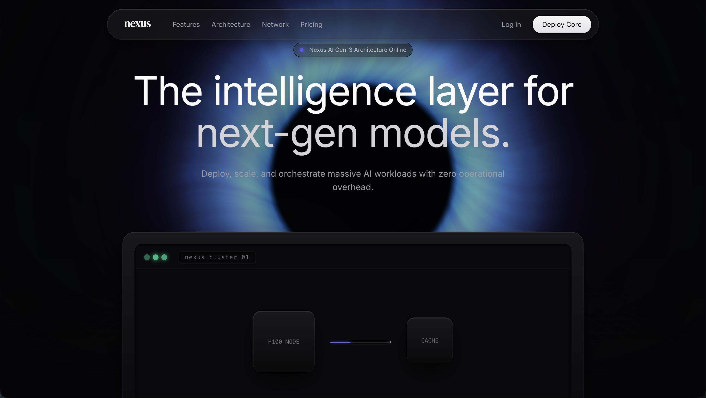
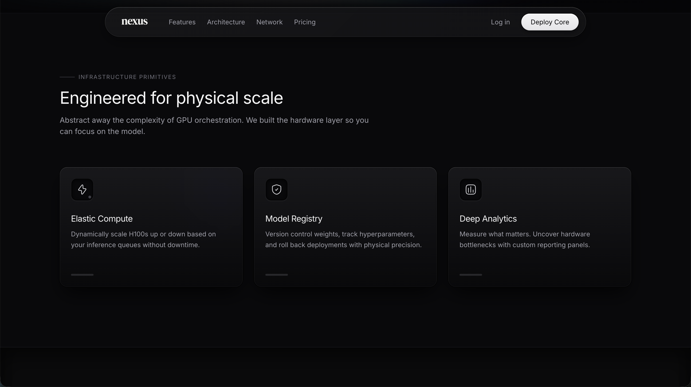
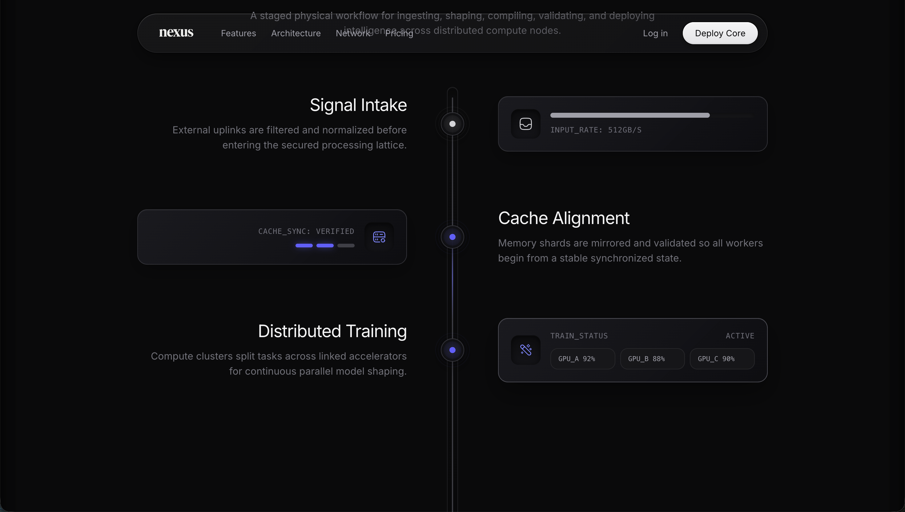
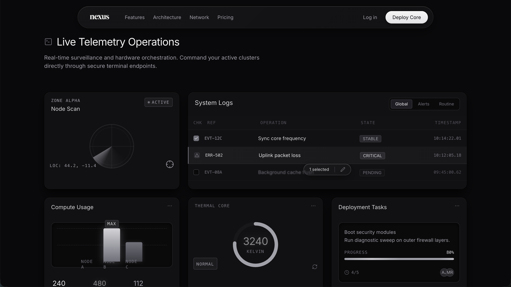
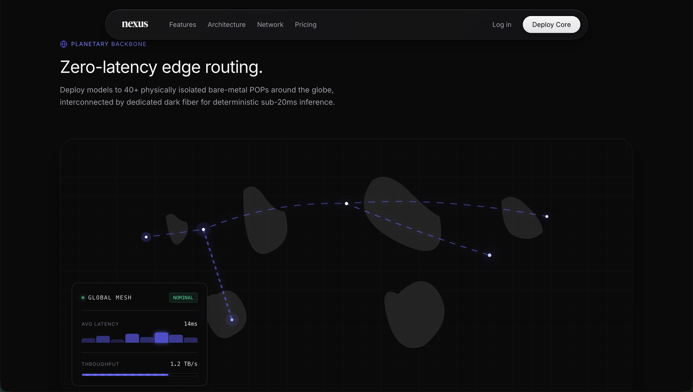

# Nexus

Nexus is a high-performance marketing site built with Next.js App Router, Tailwind CSS v4, and optimized Three.js WebGL effects.

Production URL: [https://nexus-ai-template.vercel.app](https://nexus-ai-template.vercel.app)

## Screenshots

## Quick Start

1. Install dependencies:
   - `npm install`
2. Run local development:
   - `npm run dev`
3. Open:
   - [http://localhost:3000](http://localhost:3000)

## Scripts

| Command | Purpose |
|--------|---------|
| `npm run dev` | Start the local development server |
| `npm run build` | Build for production |
| `npm run start` | Start the production server |
| `npm run lint` | Run ESLint checks |

## Project Structure

- `app/` — App Router pages and global styles
- `components/layout/` — Navigation, footer, and shared page shell
- `components/home/` — Home page client logic and hero WebGL setup
- `components/features/` — Features page client logic
- `components/webgl/` — Shared ambient and themed WebGL components
- `lib/` — Utility functions and generated page content exports

## Performance Notes

- WebGL rendering pauses when the tab is hidden to reduce wasted GPU cycles.
- Device pixel ratio is capped for smoother animation on high-density displays.
- `lucide-react` imports are optimized through `next.config.ts`.

## SEO and Crawling

- Canonical and social metadata is configured in `app/layout.tsx`.
- Dynamic sitemap: [https://nexus-ai-template.vercel.app/sitemap.xml](https://nexus-ai-template.vercel.app/sitemap.xml)
- Dynamic robots policy: [https://nexus-ai-template.vercel.app/robots.txt](https://nexus-ai-template.vercel.app/robots.txt)
- LLM crawl guidance: [https://nexus-ai-template.vercel.app/llms.txt](https://nexus-ai-template.vercel.app/llms.txt)

## License

MIT — see [LICENSE](./LICENSE).
